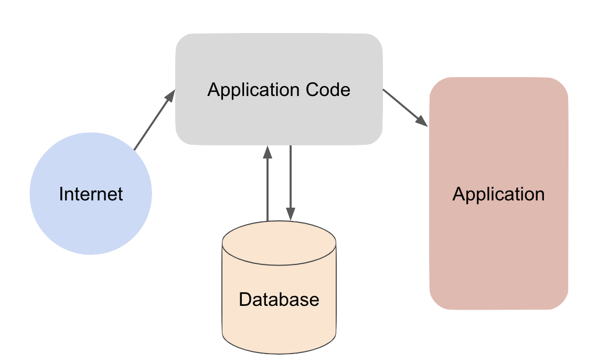

# Offline Cache



#### Network Caching
- Cache results per query
- Http Caching
- Store internet results on disk

#### Cache Validation
Knowing the cache is out of date 

#### Best way to store offline cache
Using the SQL database is handy for huge and structured data. E.g. ```Room```


|               | Room            | SharedPreference | File System |
|:--------------|:----------------|:-----------------|:------------|
| Data Format   | Structured Data | Key / Value      | Anything    |
| Data Size     | Big             | Small            | Big         |
| Complex Query | Yes             | No               | Difficult   |


